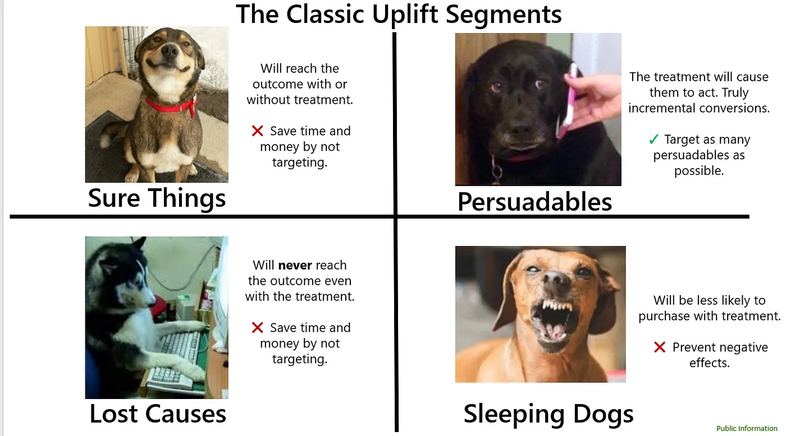
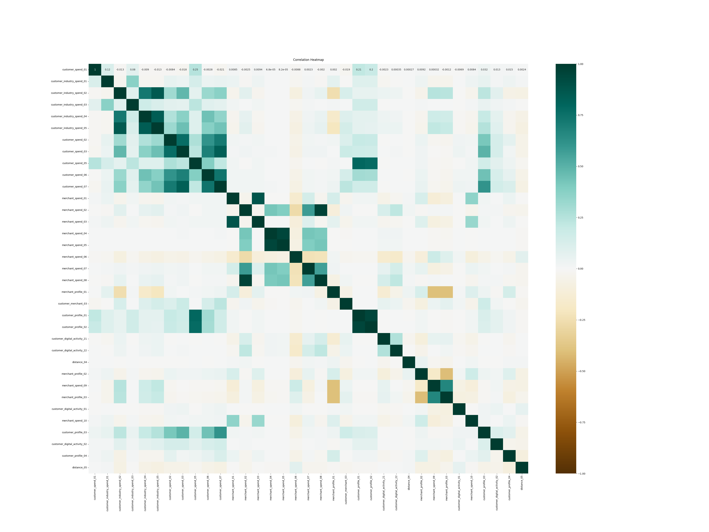

# AMEX Hackathon 2024 &ndash; Uplift Prediction

## At a Glance

This repository contains my submission for an ML hackathon organised by AMEX in March 2024. In this README, I provide a detailed background of the task for readers unfamiliar with uplift modelling, along with an outline of my methods, from data cleaning to feature selection, model selection, and hyperparameter tuning. This submission achieved a top 25 placing on the leaderboard among several hundred groups. 

## Background

The objective for this hackathon was to optimise AMEX's merchant recommender system, ultimately enabling them to achieve their business objectives. 

### Why is this important to AMEX?

AMEX's overall goal, just like any other business, is to drive revenue (and thus profits). To do so, AMEX implemented a merchant recommender system that aims to recommend merchants to customers and entice customers to spend at these merchants. However, there exists the possibility that AMEX happens to recommend a merchant that the customer was going to visit anyway (this will be further elaborated upon in the next subsection). Since there is a limit to the number of recommendations that can be made at any one point in time, the revenue-maximisation approach would be to recommend only merchants that the customer would not have otherwise discovered.

To do so, we need to introduce the concept of activation, and more importantly incremental activation.

### What is incremental activation rate?

Firstly, activation is defined as the visitation, and subsequent transaction, of a merchant by a given customer. Activations can be classified as organic or inorganic. Organic activations refer to activations that occur for merchants that were NOT recommended by AMEX. Incremental activation rate (IAR) is given by the activation rate for merchants that were recommended by AMEX minus the activation rate for merchants that were not recommended by Amex (i.e. organic activation rate). 

In other words, IAR = P(activation | recommended) - P(activation | not recommended)

### Introducing uplift

As this is not meant to be an in-depth lecture on uplift, I will briefly mention the main concepts. For each merchant, customers can be classified into four categories &ndash; sure things, persuadables, lost causes, and sleeping dogs (figure 1). 

Source: https://towardsdatascience.com/a-quick-uplift-modeling-introduction-6e14de32bfe0

In other words, 
- Persuadables: P(activation | recommended) = 1 and P(activation | not recommended) = 0
- Sleeping dogs: P(activation | recommended) = 0 and P(activation | not recommended) = 1
- Sure things: P(activation | recommended) = 1 and P(activation | not recommended) = 1
- Lost causes: P(activation | recommended) = 0 and P(activation | not recommended) = 0

Evidently, we should not recommend merchants to customers who are lost causes or sleeping dogs for those particular merchants. However, as mentioned in the above subsection, we also do not want to recommend merchants that the customer would be sure to visit, as this would not result in an INCREASE in revenue, since the customer would have transected there anyway. 

### Reframing the problem

We now have on our hands not only an ML problem, but also a causal inference problem (Gutierrez &  G´erardy, 2016). The overall task is to utilise ML methods to estimate the Conditional Average Treatment Effect (CATE), where treatment in this case refers to recommendations, and the effect of the treatment refers to activation. However, this leads to another issue, one that is core to the entire concept of uplift modelling and causal inference at large. There is no ground truth. After all, merchants cannot be both recommended AND not recommended to the same customer. Thus, for a customer that had been recommended a particular merchant, we will never truly know whether the customer would have also activated had they not been recommended that merchant. 

This counter-factual nature of our task underpins the importance of using causal inference methods such as uplift modelling instead of merely predicting whether or not the customer would activate at a given merchant. 

## Data sources

The datasets were provided by AMEX for the purpose of the hackathon and belongs wholly to them, thus I am not at liberty of sharing the datasets here. Please contact AMEX for any requests regarding the data. 

Datasets provided include:
- Training dataset comprising 12,229,978 observations and 71 columns (67 features, customer ID, merchant ID, activation flag, and recommendation flag)
- Test dataset comprising 12,604,600 observations and 69 columns (67 features, customer ID, and merchant ID)

## Methods

Since the raw datasets were out-of-memory (the training dataset was a 4.06GB CSV file; the test dataset was a 4.13GB CSV file) for my laptop, I used [Dask](https://www.dask.org/) to import them in partitions, and saved each partition as a parquet file for greater efficiency over CSVs. Once the dataframe was trimmed considerably (as features and observations were dropped) and became in-memory, I saved the entire dataframe as a parquet file and performed the rest of the analysis using Pandas.

### EDA 

#### Data profiling

The dataset was first profiled using the `ydata-profiling` tool. This revealed key characteristics of the data at a glance, such as their distributions, and the presence of any unusual values or missing data. The following steps were taken:

- Features with >50% missingness were dropped. 
- Observations with missing values in >50% of all features were also dropped.
- -999 values (clearly invalid based on the name and distribution of the features) were replaced with NaNs. 

#### Missing data imputation

I used a crude data imputation strategy, depending on the type of data (quantitative vs qualitative) and its distribution (skewed or not). 

- **Mean** imputation for non-skewed numerical variables.
- **Median** imputation for skewed numerical variables.
- **Mode** imputation for categorical variable.

In hindsight, I acknowledge that this approach towards missing data imputation is heavily flawed. Firstly, it assumes that the missing data are missing completely at random (MCAR) &ndash; a strong assumption. While it is difficult to determine if data is missing at random or not (oftentimes, substantial domain knowledge is required &ndash; which I regrettably lack), there exists statistical tests (such as Little's test) which allow us to determine if the missing data is missing completely at random or merely missing at random (MAR). The MAR assumption, being weaker than the MCAR assumption, would likely hold to a greater extent. Techniques appropriate for MAR data, such as multiple imputation or maximum likelihood imputation, would then be more robust and result in less biased model estimates.

Also, imputed variables were rounded off to the nearest integer or to 2 decimal places, based on the characteristics of the other values in the feature. Looking back, this was definitely a mistake as Horton and colleagues (2003) had shown that rounding off imputed values can cause biased model estimates even if it makes intuitive sense to do so.

### Feature selection and engineering

#### Multicollinearity

To check for the presence of multicollinearity, a correlation matrix was generated to examine pairwise correlations between variables. Pairs of variables that were highly correlated were scrutinised and one of them was dropped. More details on the correlations found and rationales for dropping each variable can be found in the notebook. 

Again, this step is highly dependent on domain knowledge and perhaps other diagnostic steps could have been taken as well in order to make more justified feature selection decisions. 

#### PCA

Principal Component Analysis (PCA) was used for dimensionality reduction &ndash; particularly for arbitrary features with no clear definition included in the data dictionary provided by AMEX. For example, the feature `merchant_spend_02` refers to the number of customers that a merchant has. However, there was a set of 5 `distance` features that were only known as `distance_01` through `distance_05`. The meaning of each of these `distance` features were not made clear. For these arbitrary features, PCA was implemented with `n_components=1` to extract maximal information whilst reducing the overall dimension of the dataset. 

#### Other feature engineering steps

- Skewed numerical variables were log-transformed (all had a minimum value of > 0)
- `customer_digital_activity_02` (referring to number of logins by the customer) was encoded into a categorical variable with 5 levels based on percentiles.

In hindsight, discretising customer logins by percentiles is a brute-force approach; segregating customers based on the artificial boundaries of percentiles may not allow us to accurately extract all the information present in this feature. In other words, percentiles may not capture the true relationship between the feature and the response. Other clustering methods such as K-means may have been better able to identify segregation points, which could help to drive model performance.

Ultimately, 17 features were used to train the model, down from 67 in the original dataset.

### Model selection

I attempted a myriad of approaches, namely those outlined in the paper by Gutierrez and G´erardy:

- Modelling uplift directly using a single model 
- Two-model approach (dependent and independent models)
- Class transformation

More information on the specifics of each approach can be found [here](https://nbviewer.org/github/maks-sh/scikit-uplift/blob/master/notebooks/RetailHero_EN.ipynb#1.2-Class-Transformation) as well as in the 2016 Gutierrez and G´erardy paper.

I used the `scikit-uplift` library, which contains the aforementioned methods for uplift modelling using the `scikit-learn` API. 

While there exists a repertoire of uplift model evaluation metrics such as the area under Qini curve, for the purposes of this hackathon I used the incremental activation rate (IAR) &ndash; a metric provided by AMEX. 

I used gradient boosted trees (`XGBoost`) with default hyperparameters as the estimator in each of the above methods. I found that the class transformation approach outperformed the other approaches. 

### Hyperparameter tuning

Using IAR as the evaluation metric, grid search was performed with 5-fold cross-validation with the following `param_grid`:

| Hyperparameters | Values | 
| --- | --- |
| max_depth | 2, 3, 4 | 
| learning_rate | 0.01, 0.1, 0.2 | 
| n_estimators | 50, 100, 200 | 
| lambda | 1, 10, 100 | 
| alpha | 1, 10, 100 | 

The best hyperparameters were:

| Hyperparameters | Values | 
| --- | --- |
| max_depth | 4 | 
| learning_rate | 0.2 | 
| n_estimators | 200 | 
| lambda | 100 | 
| alpha | 10 | 

Finally, recursive feature elimination with cross-validation (RFECV) was implemented using this model configuration to see if model performance could be further improved with a subset of the features used (by removing noisy features). 

Interestingly, the best-performing model in the end only had 2 features &ndash; `merchant_profile_01` and `customer_login_discretized`. I personally find this result quite peculiar, and would relish the opportunity to dive further into this dataset. 

## Other interesting observations

A key assumption of the class transformation approach is that the probabiity of treatment (i.e. whether a merchant is recommended to a customer or not) is 0.5. In other words, recommendations should be randomly assigned to customers, and the dataset should have a balanced number of recommended and non-recommended merchant-customer pairs. 

That said, it was clearly stated in the problem statement that merchant recommendations were randomly assigned to customers. However, the dataset was relatively imbalanced (there were more non-recommended observations than recommended ones). I attempted to balance the datasets by downsampling the recommended observations, however that actually worsened the performance of the model. Unfortunately, my insufficient grasp of the relevant statistical concepts prevents me from fully understanding why this is the case, as well as whether or not balancing is even needed since we already know that merchant recommendations were assigned at random to customers.

## Final thoughts and personal reflections

This hackathon has been my first experience with uplift modeling and causal inference, and it has been incredibly valuable. I've gained a deeper understanding of the statistical concepts underlying causal inference, where we lack a "ground truth" and thus cannot approach it like any other supervised learning task. Uplift modeling is an incredibly useful technique that has a place in not just clinical studies, but also many other businesses across industries. As such, I firmly believe it's a critical skill for any data scientist to have in their repertoire.

Beyond learning about uplift modeling, this experience has also sharpened my data analysis and pre-processing skills &ndash; again, essential tools for any data practitioner. While I made (glaring) mistakes during the analysis, I also learned a great deal from them in the process. In time to come, I hope to come back to this project as a more experienced data scientist and identify even more areas for improvement.

I want to thank the AMEX team for organizing this hackathon &ndash; it has been an incredible learning experience. While I feel that I've grown as a data scientist during this journey, it has also highlighted just how much more there is to learn.

## References

Temple, S. (2020, June 28). Uplift Modeling: A Quick Introduction. Medium. 
https://towardsdatascience.com/a-quick-uplift-modeling-introduction-6e14de32bfe0 

Siegel, E. (2011, October 19). Persuasion by the Numbers: Optimize Marketing Influence by Predicting It. 
https://www.predictiveanalyticsworld.com/newyork/2011/presentations/pdf/DAY1_0900_siegel-web.pdf

Gutierrez, P., &  G´erardy, J.-Y. (2016). Causal Inference and Uplift Modeling: A review of the literature. JMLR: Workshop and Conference Proceedings, 67, 1–13. 
https://proceedings.mlr.press/v67/gutierrez17a/gutierrez17a.pdf 

Nguyen, M. (2020). A Guide on Data Analysis. Bookdown.
https://bookdown.org/mike/data_analysis/

Horton, N. J., Lipsitz, S. R., & Parzen, M. (2003). A Potential for Bias When Rounding in Multiple Imputation. The American Statistician, 57(4), 229–232. 
http://www.jstor.org/stable/30037286

